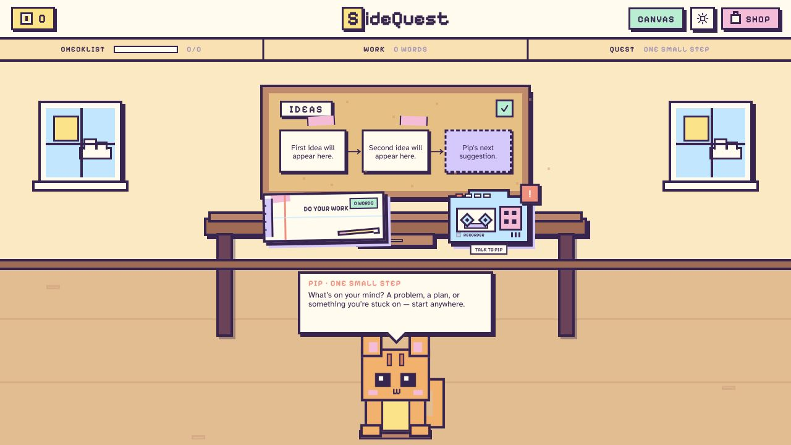

<div align="center">

# SideQuest

**A small step, a cozy space, and a cat named Pip.**

Talk through what is on your mind. Find a starting point. Make it your own.

[Open SideQuest](https://www.sidequestspace.com) · [Get started](#run-it-locally) · [Meet the workspace](#make-room-for-your-next-idea)

</div>



## Make room for your next idea

SideQuest is a study and task workspace designed with ADHD students in mind.
Bring a math problem, a rough draft, or a task you have been putting off. Pip helps
you think it through and choose one manageable next step while you do the work.

- **Think out loud.** Talk or type to Pip for short, contextual guidance.
- **Untangle your thoughts.** Capture ideas, connect cards, and break a task into steps.
- **Work beside your plan.** Keep notes and drafts next to the canvas.
- **Explore the math.** Add equations and interactive function graphs, then ask Pip about them.
- **Make the room yours.** Earn coins for new ideas and completed steps, and spend them on decorations.
- **Pick up where you left off.** Your browser saves the workspace, with Undo for canvas changes.

The sun and moon switch between day and night. Pip stays with you when you open
the canvas.

## Try a small quest

1. Open **Canvas** and tell Pip what you want to work on.
2. Ask for a small step, or add an idea yourself.
3. Open **Your work** to write. For math, try **Math** or ask Pip to graph `y = x^2 - 4`.
4. Complete a step, collect your coins, and visit the room's **Shop**.

## Run it locally

Use Node.js 22 and npm.

```bash
git clone https://github.com/ChrisH0125/SideQuest.git
cd SideQuest
npm install
cp .env.example .env.local
npm run dev
```

Open [localhost:3000](http://localhost:3000). Add your settings to the ignored
`.env.local` file:

| Variable | Used for |
| --- | --- |
| `GEMINI_API_KEY` | Server-side Gemini coaching |
| `GEMINI_TEXT_MODEL` | Primary text model |
| `GEMINI_TEXT_FALLBACK_MODEL` | Fallback for temporary model failures |
| `NEXT_PUBLIC_VAPI_PUBLIC_KEY` | Vapi's browser-safe public key |
| `NEXT_PUBLIC_VAPI_ASSISTANT_ID` | Your published Pip assistant |

The example file includes the text model settings. For voice, follow the
[Pip setup and prompt](docs/vapi-pip-instructions.md). Keep private keys out of
browser variables and never commit `.env.local`.

## Built with

Next.js · React · TypeScript · React Flow · Gemini · Vapi

The room began in Figma Make. A shared, validated command path handles manual
and AI canvas actions. Equations use MathML; function graphs are calculated
locally from bounded expressions.

## Development

| Command | Purpose |
| --- | --- |
| `npm run dev` | Start the development server |
| `npm run build` / `npm start` | Build and run for production |
| `npm run typecheck` | Check TypeScript |
| `npm run test:api` | API regression tests |
| `npm run test:pip-actions` | AI actions, Undo, and duplicate protection |
| `npm run test:math` | Math parsing, plotting, and persistence |
| `npm run test:voice` | Voice configuration and startup failures |
| `node scripts/check-workspace.cjs` | Workspace and reward regressions |
| `npm run smoke:api` | Test a running app with real Gemini replies |
| `npm run lint` | Run ESLint |

## A few practical details

Work is saved in this browser, on this site's address. Use **Download work** for
a portable copy. Changing devices or moving from localhost to the live site
starts a separate workspace.

Graphs show numerical samples, not algebraic proofs. Clear canvas preserves your
written work, goal, coins, and purchases. Live voice conversation has been tested;
the new voice graph actions still need a full live-call check.

[Deployment and domain setup](docs/deployment.md) · [Math notation](docs/math.md) ·
[API](docs/api.md) · [Roadmap](docs/refinement-plan.md) ·
[Verification history](docs/verification.md) · [Team guide](AGENTS.md)
